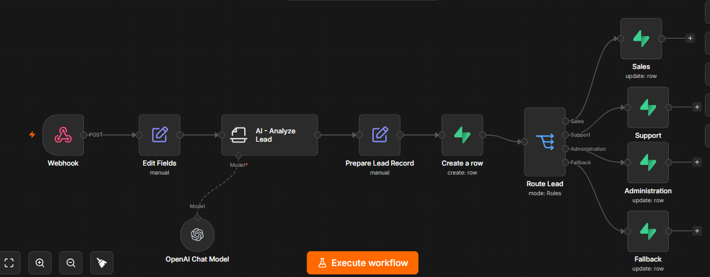
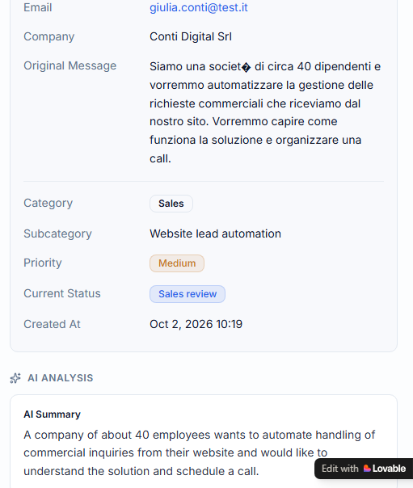
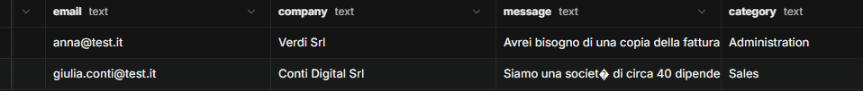
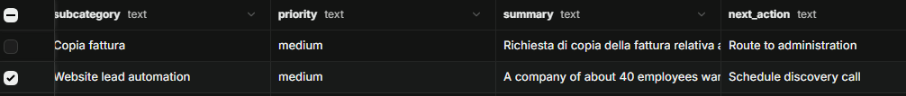

# LeadFlow AI

LeadFlow AI is a simple AI-powered lead intake and qualification workflow designed as an MVP for small and medium-sized businesses.

The goal of the project is to automate the first steps of lead handling: receiving a request, structuring the data, storing it, and later classifying it with AI.

## Business Problem

Many SMEs receive customer or sales requests through website forms, email, or other channels.

These requests often need to be manually reviewed before they can be stored, classified, and assigned to the appropriate next action.

LeadFlow AI demonstrates how this process can be partially automated using a lightweight workflow.

## MVP Flow

Current version:

Lead Request
↓
n8n Webhook
↓
Edit Fields / Data Normalization
↓
Supabase

Planned version:

Lead Request
↓
n8n Webhook
↓
Data Normalization
↓
AI Classification
↓
Business Rules
↓
Supabase
↓
Lovable Dashboard

## Current Features

- Receives lead data through an n8n webhook
- Normalizes incoming JSON data
- Creates a new lead record in Supabase
- Automatically generates record ID and creation timestamp
- Stores leads for future AI processing

## Lead Data

The current MVP processes:

{
  "name": "Mario Rossi",
  "email": "mario@test.it",
  "company": "Rossi Srl",
  "message": "Vorrei automatizzare la gestione delle fatture."
}

## Tech Stack

- n8n — workflow automation and orchestration
- Supabase — database and backend
- Lovable — frontend and dashboard
- AI / LLM — lead classification and response generation
- GitHub — documentation and version control

## Project Status

### Completed

Webhook → Data normalization → Supabase

### Next Steps

- Add AI lead classification
- Extract structured lead information
- Add priority and category rules
- Generate suggested next actions
- Build a Lovable dashboard
- Add human approval for AI-generated responses

## Security

No credentials or API keys are stored in this repository.

Sensitive values such as database credentials and API keys must be managed through environment variables or secure credential stores.

## MVP Validation

The LeadFlow AI MVP has been tested successfully end-to-end.

The validated workflow is:

Incoming Lead
→ n8n Webhook
→ Data Normalization
→ AI Classification
→ Structured Output
→ Supabase Record Creation
→ Deterministic Routing
→ Status Update
→ Lovable Dashboard

### Tested Scenarios

The workflow has been tested with different types of inbound requests:

- Sales
- Support
- Administration
- Partnership / Manual Review

The AI classifies the incoming request, while n8n applies deterministic workflow rules.

Example routing:

Sales
→ sales_review

Support
→ support_review

Administration
→ administration_review

Other or unmatched categories
→ manual_review

### End-to-End Test

A new test lead was submitted through the production n8n webhook.

The system automatically:

1. received the inbound request
2. normalized the lead information
3. analyzed the message using AI
4. generated structured classification data
5. stored the lead in Supabase
6. routed the lead using n8n business rules
7. updated the workflow status
8. displayed the new lead automatically in the Lovable dashboard

No manual database or frontend update was required.

This confirmed that the MVP works as an integrated automation system rather than as separate disconnected components.

## Screenshots

### n8n Workflow

### LeadFlow Dashboard

### Lead Detail

### Supabase Data

## Current Architecture

Lead Source
↓
n8n Webhook
↓
Data Normalization
↓
AI Classification
↓
Structured Output
↓
Supabase
↓
Business Routing
↓
Status Update
↓
Lovable Dashboard

## What This MVP Demonstrates

- workflow automation with n8n
- AI-assisted text classification
- structured AI output
- deterministic business routing
- backend persistence with Supabase
- Row Level Security and authenticated dashboard access
- frontend dashboard with Lovable
- end-to-end integration between multiple platforms
- documentation and version control with GitHub

## Next Possible Improvements

Future versions could include:

- AI-generated reply drafts
- human approval before sending responses
- email notifications
- automatic department notifications
- duplicate lead detection
- CRM integration
- workflow analytics
- response-time tracking
- additional user roles and permissions
